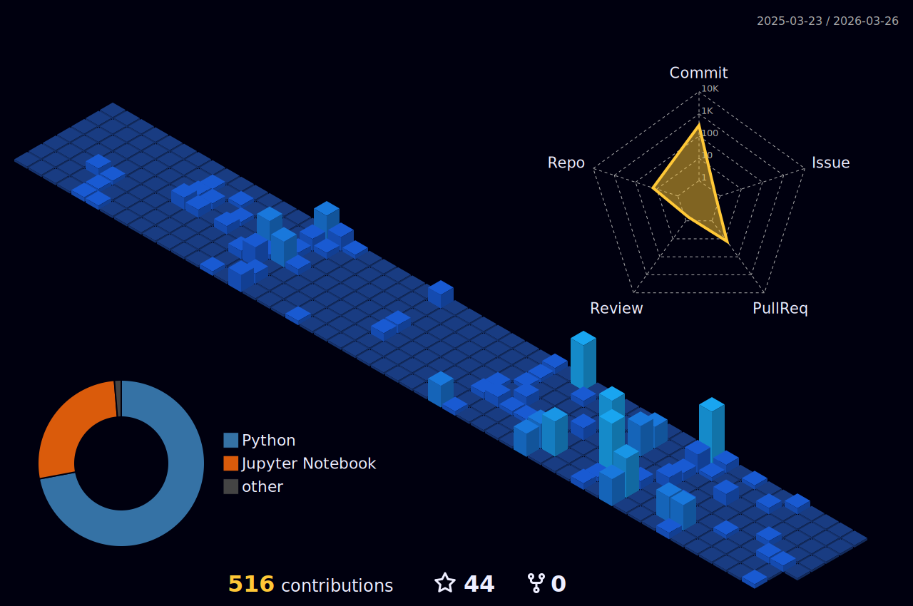

<h1 align="center">Hi, I'm Oleg 👋</h1>

  <b>ML Engineer / Data Scientist</b> 
  ML Engineer • CV pipelines • DL architectures • AI engineering

  
  &nbsp;
  
  &nbsp;
  

  

---

## 👨‍💻 About Me

- ML Engineer specializing in computer vision, deep neural models and applied AI systems  
- Build end-to-end pipelines: data processing, training, evaluation and deployment  
- Develop CV models, deep learning workflows and practical LLM-powered tools  
- Core technologies: PyTorch, Scikit-learn, Transformers (HuggingFace), TensorRT, Grafana, Docker, Kubernetes  
- Currently pursuing a BSc in AI at Innopolis University and working on research projects  

---

## Tech Stack

### Languages & Core Ecosystem

---

### Deep Learning & Scientific Stack

---

### Computer Vision & Inference

---

### LLM & Generative AI

---

### Classical ML

---

### Reinforcement Learning

---

### Data Engineering / ETL

---

### MLOps & Infrastructure

---

### APIs & Serving

---

### Data Storage

## 🏙  Contributions

---

## ✨ Random Quote

---

